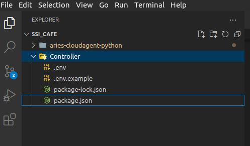
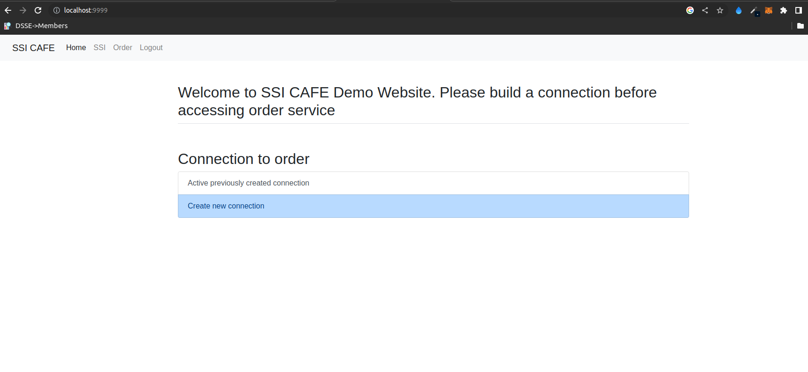
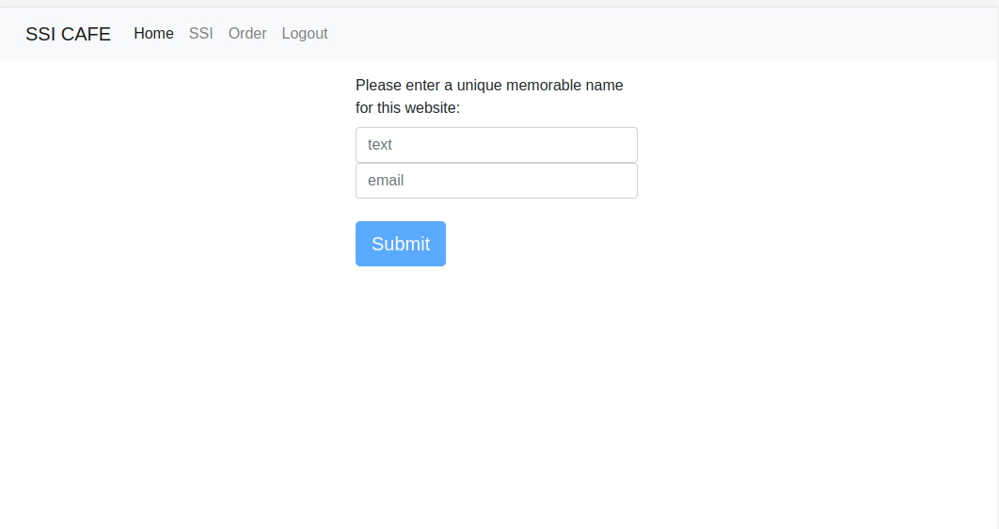

# ReLABS at BRACU Presents: Intro to SSI for web - Part II

## Prerequisites
* You have completed the [tutorial 01](https://github.com/YEASIN49/SSI4WEB_SAMPLE_TUTORIAL-01-Connection-Building-and-Playing-with-demo).
* You are familier with NodeJs, mongodb.
* You have mongodb installed locally.
* You know what is API and how to call it.
* Nice to have server side rendering knowledge( we are using ejs )
* Simple Basics of html

## Goal
In this tutorial we will understand how we can utilize aca-py in web technology. We will learn:
*   Admin API of ACA-PY
*   Controller to use the API according to our necessity
*   A demo application to understand to overall workflow


**Note: This is a tutorial of SSI. Therefore there are a lot of usecase and functionality that are ignored during the development. The goal of this tutorial is to make the learners understand how they can create applications utilising SSI.**

This is the second part of our **BRACU ReLABS Presents: Intro to SSI** for web Starter tutorial.

If you do not complete the first tutorial, go and complete it from **HERE**.

**NOTE**: By this part of the tutorial you should have aries-cloud-agent-python(aca-py), MySSIController, aries-mobile-agent-react-native built on you mobile device. Also it is assumed that you know how to start aca-py and MySSIController. In this part of tutorial we will work with aries-cloudagent-python(aca-py) and we will create a new controller which will utilize the Admin API of aca-py

### What are we going to build ?
In BRAC University, we often need to maintain a long queue to order food. Therefore, we can build an application which can idenify students through a verifiable credential which proves the identity of students that he is from BRAC University or not. After the identity validation, students can order the food from a web page and they don't need to maintain any queue. we will build a SSI based application through which only students of BRAC university can order frood from the web application.

## Let's Start building the Controller
### Part 01: setting files and server
1. Create a folder ```SSI_CAFE```. Open it from VSCode.

2. Download/clone the Controller folder from this repo. Paste this controller inside the SSI_CAFE folder. Also, paste the aca-py that you used in tutorial 1 inside this SSI_CAFE folder.

3. The Controller folder currently contains package.json, package-lock.json and and .env.example file inside it.



4. Now, go to the controller folder using the command:
```shell
cd Controller
```
Next, run the command:

```shell
npm i
```
This will create all the required packages inside node_modules folder.

5. Now, create a file ```server.js``` inside Controller folder. 


6. copy the content provided below and paste it to the ```server.js``` file.

```js
const express = require('express')
const path = require('path')
const bodyParser = require('body-parser')
const mongoose = require('mongoose')
const bcrypt = require('bcryptjs')
const jwt = require('jsonwebtoken')
const qr = require("qrcode");
const session = require('express-session')
const axios = require('axios');
var qs = require('querystring');
const cookieParser = require('cookie-parser')
const exphbs = require('express-handlebars')
const helpers = require('handlebars-helpers')
var nodemailer = require('nodemailer')
require('dotenv').config() 


// setting global attributes
global.connectionId = null;
global.credDef = null;
global.credStatus = null;
global.proofStatus = null;
global.retrievedAttribute = null;

// connecting to mongodb where the database name is ssi-cafe
mongoose.connect('mongodb://127.0.0.1:27017/ssi-cafe', {
	useNewUrlParser: true,
	useUnifiedTopology: true,
	useCreateIndex: true
})

// initiating the express js
const app = express()

// setting session for express
const oneDay = 1000 * 60 * 60 * 24;
app.use(session({
    secret: "this_is_your_random_secrcte_key_fhrgfgrfrty84fwir767",
    saveUninitialized: truesssssssssssssssssssssssssssssssssssssssssssss,
    cookie: { maxAge: oneDay },
    resave: false 
}))

// setting up the server side render engine  
app.set("view engine", "ejs");

// setting up various parsers
app.use(bodyParser.urlencoded({ extended: false }));
app.use(bodyParser.json());
app.use(cookieParser());

// Simple routing to the index.ejs file
app.get("/", (req, res) => {
    res.render("index");
})

/*************************************************************
 *  ALL OF YOUR API SHOULD BE WRITTEN BELOW THIS LINE
*************************************************************/


/*************************************************************
 *  ALL OF YOUR API SHOULD BE ABOVE BELOW THIS LINE
*************************************************************/
app.listen(9999, () => {
	console.log('Server up at 9999')
})
```

The above code of holds the basic server configuration. This server will be accessible from the brrowser at http://localhost:9999 and when we visit this url it will render the content of base route which is "/". This base route basically renders the index.ejs file which we will create in the next step and this will be the home page of our application.

7. Now, create a folder called ```views``` inside the **Controller** folder and then create the mentioned file called ```index.ejs``` inside the **views** folder.

copy the content provided below and paste it to the ```index.ejs``` file.

```ejs
<!DOCTYPE html>
<html lang="en">
	<head>
		<meta charset="UTF-8" />
		<!-- Required meta tags -->
		<meta name="viewport" content="width=device-width, initial-scale=1, shrink-to-fit=no">
		<!-- Bootstrap CSS -->
		<link rel="stylesheet" href="https://stackpath.bootstrapcdn.com/bootstrap/4.3.1/css/bootstrap.min.css" integrity="sha384-ggOyR0iXCbMQv3Xipma34MD+dH/1fQ784/j6cY/iJTQUOhcWr7x9JvoRxT2MZw1T" crossorigin="anonymous">
		<title>Document</title>
	</head>
	<body>
	<!-- jQuery first, then Popper.js, then Bootstrap JS -->
    <script src="https://code.jquery.com/jquery-3.3.1.slim.min.js" integrity="sha384-q8i/X+965DzO0rT7abK41JStQIAqVgRVzpbzo5smXKp4YfRvH+8abtTE1Pi6jizo" crossorigin="anonymous"></script>
    <script src="https://cdnjs.cloudflare.com/ajax/libs/popper.js/1.14.7/umd/popper.min.js" integrity="sha384-UO2eT0CpHqdSJQ6hJty5KVphtPhzWj9WO1clHTMGa3JDZwrnQq4sF86dIHNDz0W1" crossorigin="anonymous"></script>
    <script src="https://stackpath.bootstrapcdn.com/bootstrap/4.3.1/js/bootstrap.min.js" integrity="sha384-JjSmVgyd0p3pXB1rRibZUAYoIIy6OrQ6VrjIEaFf/nJGzIxFDsf4x0xIM+B07jRM" crossorigin="anonymous"></script>
	
		<nav class="navbar navbar-expand-lg navbar-light bg-light">
			<div class="container-fluid">
				<a class="navbar-brand" href="#">SSI CAFE</a>
				<button class="navbar-toggler" type="button" data-bs-toggle="collapse" data-bs-target="#navbarSupportedContent" aria-controls="navbarSupportedContent" aria-expanded="false" aria-label="Toggle navigation">
				<span class="navbar-toggler-icon"></span>
				</button>
				<div class="collapse navbar-collapse" id="navbarSupportedContent">
				<ul class="navbar-nav me-auto mb-5 mb-lg-0">
					<li class="nav-item">
					<a class="nav-link active" aria-current="page" href="/">Home</a>
					</li>
					<li class="nav-item">
					<a class="nav-link" href="/connected">Credential</a>
					</li>
					<li class="nav-item">
					<a class="nav-link" href="/food">Order</a>
					</li>
					<li class="nav-item">
					<a class="nav-link" href="/logout">Logout</a>
					</li>
				</div>
			</div>
		</nav>

		<div class="container px-4 py-5" id="featured-3">
			<h2 class="pb-2 border-bottom">Welcome to SSI CAFE Demo Website. Please build a connection before accessing order service</h2>
			<div class="row g-4 py-5 row-cols-1 row-cols-lg-3">
				<div class="feature col">
					<h2>Connection to order</h2>
					<div class="list-group">
						<a href="/reconnect" class="list-group-item list-group-item-action">Active previously created connection</a>
						<a href="/newConData" class="list-group-item list-group-item-action list-group-item-primary">Create new connection</a>
					</div>
				</div>
			</div>
		</div>

	</body>
</html>
```

The content above holds the route reference and the html elements of our application and this is the home page of our application. 

8. Now, open the terminal from the VSCode and change the path to the Controller folder. If your terminal path is already in controller then it's ok. It is important that you terminal path should be pointing inside Controller folder.

9. Now before starting the server make sure your mongodb service are running. We are assuming you are working on ubuntu. Thus the command to start the service is: ```service mongod start```. After that, run: 

```shell
npm start
```
This will start the controller server. Now, if you open http://localhost:9999 from your browser you will see the a home page appeared there.



## Part 02: Creating New Connection 
In this section, we will create new conenction feature utilizing the Admin API of ACA-PY. 

1. First start the aca-py in the similar way that we did in tutorial 01 using ngrok. When the aca-py starts, it initiate an API service and for the ease of understanding, the documented API is present using [Swagger](https://swagger.io/). We can play with the API's from the browser from http://localhost:8021 

2.. In the ```server.js```  file, you will see that when we click to the **Create new connection** option, it navigates us to "/newConData" route. This is basically the frontend routing path for creating new connection. Therefore, we will complete this now. First, we need to create the API which should be called as the same name as "/newConData". So that whenever a user clicks it, he/she gets a new page from where the can create a conenction. Therefore, copy the API provided below and paste it to server.js file in between the mentioned place to write api.

```js
app.get('/newConData', (req, res) => {
	res.render("invitationData")
})
```
The above API receives a request from user and render/return a new page called **"invitationData"** which is basically a file called **invitationData.ejs**

3. Now, we will create this **invitationData.ejs** file from where user will create a new connection using the Admin API which is provided by aca-py. To do this, create a file called **invitationData.ejs** inside **views** folder and paste the following code in it.

```js
<!DOCTYPE html>
<html lang="en">
	<head>
		<meta charset="UTF-8" />
		<!-- <meta name="viewport" content="width=device-width, initial-scale=1.0" /> -->
		<!-- Required meta tags -->
		<meta name="viewport" content="width=device-width, initial-scale=1, shrink-to-fit=no">
		<!-- Bootstrap CSS -->
		<link rel="stylesheet" href="https://stackpath.bootstrapcdn.com/bootstrap/4.3.1/css/bootstrap.min.css" integrity="sha384-ggOyR0iXCbMQv3Xipma34MD+dH/1fQ784/j6cY/iJTQUOhcWr7x9JvoRxT2MZw1T" crossorigin="anonymous">
		<meta name="theme-color" content="#7952b3">
    	<!-- Custom styles for this template -->
    	<link href="signin.css" rel="stylesheet">
		<style>
			.form-signin {
			width: 100%;
			max-width: 330px;
			padding: 15px;
			margin: auto;
			}

			.form-signin .checkbox {
			font-weight: 400;
			}

			.form-signin .form-floating:focus-within {
			z-index: 2;
			}

			.form-signin input[type="email"] {
			margin-bottom: -1px;
			border-bottom-right-radius: 0;
			border-bottom-left-radius: 0;
			}

			.form-signin input[type="password"] {
			margin-bottom: 10px;
			border-top-left-radius: 0;
			border-top-right-radius: 0;
			}

		</style>
		<title>Document</title>
	</head>
	<body>
		<script src="https://code.jquery.com/jquery-3.3.1.slim.min.js" integrity="sha384-q8i/X+965DzO0rT7abK41JStQIAqVgRVzpbzo5smXKp4YfRvH+8abtTE1Pi6jizo" crossorigin="anonymous"></script>
    	<script src="https://cdnjs.cloudflare.com/ajax/libs/popper.js/1.14.7/umd/popper.min.js" integrity="sha384-UO2eT0CpHqdSJQ6hJty5KVphtPhzWj9WO1clHTMGa3JDZwrnQq4sF86dIHNDz0W1" crossorigin="anonymous"></script>
    	<script src="https://stackpath.bootstrapcdn.com/bootstrap/4.3.1/js/bootstrap.min.js" integrity="sha384-JjSmVgyd0p3pXB1rRibZUAYoIIy6OrQ6VrjIEaFf/nJGzIxFDsf4x0xIM+B07jRM" crossorigin="anonymous"></script>

		<nav class="navbar navbar-expand-lg navbar-light bg-light">
			<div class="container-fluid">
				<a class="navbar-brand" href="#">SSI CAFE</a>
				<button class="navbar-toggler" type="button" data-bs-toggle="collapse" data-bs-target="#navbarSupportedContent" aria-controls="navbarSupportedContent" aria-expanded="false" aria-label="Toggle navigation">
				<span class="navbar-toggler-icon"></span>
				</button>
				<div class="collapse navbar-collapse" id="navbarSupportedContent">
				<ul class="navbar-nav me-auto mb-5 mb-lg-0">
					<li class="nav-item">
					<a class="nav-link active" aria-current="page" href="/">Home</a>
					</li>
					<li class="nav-item">
					<a class="nav-link" href="/connected">Credential</a>
					</li>
					<li class="nav-item">
					<a class="nav-link" href="/food">Order</a>
					</li>
					<li class="nav-item">
					<a class="nav-link" href="/logout">Logout</a>
					</li>
				</div>
			</div>
		</nav>

        <main class="form-signin">
            <div class="form-floating">
            <label for="floatingInput">Please enter a unique memorable name for this website:</label>
            <input type="text" class="form-control" name="name" id="memName" placeholder="memoName">
            <input type="text" class="form-control" name="email" id="email" placeholder="email">
            </div>
            <br>
			<button class="w-10 btn btn-lg btn-primary" type="submit" id="check">Check</button>
            <button class="w-10 btn btn-lg btn-primary" type="submit" id="submit" disabled>Submit</button>
        </main>

		<script>
            // when the check button is clicked the below function gets triggered
			$(document).ready(function () {
				$(document).on('click', '#check', async function(e){ 
				var memoName;
				if (!$('#memName').val()) {
            		alert('Enter a memorable name!');
  				}if (!$('#email').val()) {
            		alert('Enter your email address!');
  				} else {
					memoName = $('#memName').val(); 
					const result = await fetch('/checkMemName', {
						method: 'POST',
						headers: {
							'Content-Type': 'application/json'
						},
						body: JSON.stringify({
							memoName
						})
					}).then((res) => res.json())

					// status: true refers the memoName already exist and users should not be allowed to use the memoName
					if(result.status) {
						alert("Please choose another memorable name. ")
					} 
					// status: false refers the memoName doesn't exist and  users should not be allowed to use the memoName
					else if(!result.status) {
						alert("Your memorable name is unique. Now, please click the submit button!")
						$('#submit').prop('disabled', false)
						$('#check').prop('disabled', true)
					}
				  }
				})

                // when the submit button is clicked, the below function is triggered
				$(document).on('click', '#submit', async function(e){ 
					var memoName = $('#memName').val();
					var email = $('#email').val();
					var form = $("<form/>", 
						{ action: '/newCon', method: 'POST' }
					);
					form.append( 
						$('<input>', {type: 'hidden', id: 'memo', name: 'memoNameData', value: memoName})
					);
					form.append( 
						$('<input>', {type: 'hidden', id: 'email', name: 'emailData', value: email}
						)
					)

					form.appendTo('body').submit();
				})
			})
		</script>
	</body>
</html>

```

Now, if you click on the ```Create new connection``` button, a new page with a form will be appear like below: 



4. In the mentioned page, users will enter a unique memorable name ( memoName ) and email address and then the application will check whether the memoName already used by other users or not. If we check the code of ```invitationData.ejs``` file, we will see there is already an API endpoint ```/checkMemName``` is beign called when we click the check button from the browser. This API will do the checking part of the memoName. However, currently the API is not created yet. Therefore, we will create it now. To do this, copy the code below and pase it to ```server.js``` within the mentioned place to write code.

```js
// check if the memoName already exist or not.
app.post('/checkMemName', function(req,res) {
	const { memoName } = req.body
	// fetching the current connection
	axios.get('http://127.0.0.1:8021/connections')
		.then((resp) => {
			let flag = false;
			let conID;
			resp.data['results'].forEach((element) => {
				if(element.hasOwnProperty('alias')){
					const alias = element['alias']
					if(alias === memoName) {
						flag = true;
						conID = element["connection_id"];
						console.log("Matching found....");
					}
				}
			})
			// flag: true refers that the memoName already exist
			if(flag){
				res.setHeader('Content-Type', 'application/json');
				res.end(JSON.stringify({ status: true, connection: conID }));
			}
			// flag: false refers that the memoName doesn't exist 
			else {
				res.setHeader('Content-Type', 'application/json');
				res.end(JSON.stringify({ status: false }));
			}
		}).catch((err) => {
			console.error(err);
		});
  });
```
This API function will first fetch the existing cunnection of agent using the ```http://127.0.0.1:8021/connections``` API. Then, from the response list it try to match the ```alias``` with memoName provided by user from browser. If matched, the flag will be ```true``` which refers that there is already a connection with the same memoName. Therefore, we return ```status: true``` refering that we should not allow with this memoName. Else the ```status: false``` refers that we can allow users to use this memoName. Therefore, whenever the ```/checkMemName``` api endpoint is called, it will execute this function and work as described.

5. Now, we will try to run the agent and let's see what happens. To run the agent, follow the steps of of starting and using ````ngrok`` tunnel url in ```agent.py``` and ```faber-local.sh``` file that we did in previous tutorial. Make sure sure you are using 
your own ```--seed``` and the ```---genesis-url``` is ```http://dev.greenlight.bcovrin.vonx.io/genesis```

6. Now run the agent using the command below ensuring that you are inside the ```demo``` directory of ```aries-cloudagent-python```

```shell
LEDGER_URL=http://dev.greenlight.bcovrin.vonx.io ./run_demo faber
```

7. Now, when you start the agent, you will see there is a error in the terminal like below: 

```shell
2023-04-25 13:14:22,259 aries_cloudagent.transport.outbound.manager ERROR >>> Error when posting to: https://e50e-103-103-98-39.ngrok-free.app/webhooks/topic/connections/; Error: (<class 'aries_cloudagent.transport.outbound.base.OutboundTransportError'>, OutboundTransportError('Unexpected response status 404, caused by: Not Found',), <traceback object at 0x7f74a1b0b988>); Re-queue failed message ..
```

This is because in aca-py when we use ```--webhook-url```, every state change of agent results in an webhook event call. Therefore, when we first start the agent, it creates a connection invitation which changes the ```state``` of ```connections``` status of agent. Therefore, there will be an HTTP POST request call to ```url_of_controller/webhooks/topic/connections``` because at this stage the connection ```state``` changes to ```invitation``` and then ```await-response```. But till now, we do not have this webhook url created. This is the reason, we are getting the error. Now, to resolve the error, copy the following code and paste to ```server.js``` file. You can visit this [link](https://github.com/hyperledger/aries-cloudagent-python/blob/main/AdminAPI.md) to learn more.

```js
// receive webhook events upon state changes
app.post("/webhooks/*", (req, res) => {
	const conID = req.body['connection_id']
	const conStatus = req.body['rfc23_state']
	if(conID){
		if(conStatus === "completed"){
			connectionId= conID
		}
		if(req.body['state'] === 'credential_acked'){
			console.log("Credential acked...")
			credStatus = true
		}
		if(req.body['verified'] === 'true'){
			var base64data = JSON.stringify(req.body['presentation_request_dict']['request_presentations~attach'][0]['data']['base64'])
			const decodedString = Buffer.from(base64data, "base64");
			const jsonData = JSON.parse(decodedString.toString());
			proofStatus = true
			retrievedAttribute = jsonData['requested_attributes']['0_role']['value']
		}
	}
})
```

Here, if the ```conID```is found then we check for different properties based on different state changes. For the connection part, when the connection is ```complete```, we store the reference of connection ID in a global variable ```connectionId```. We will discuss the other two conditions later.

8. Now run the agent considering the ```ngrok``` tunnel is running and this time there should be no error.

**NOTE: Remember whenever you stop ngrok and start again, you have to update the latest url in ```agent.py```, ```faber-locah.sh``` and if needed in ```server.js```**

9. Till now, we checked whether the memoName is unique or not. Now, we will  finally create the connection. If you notice the ```invitationData.ejs``` file, you will see an event listener triggering a function call when we click the submit button. When, we click the submit button, the form POST the action to ```/newCon``` route with the value that users entered in the browser. This ```/newCon``` API endpoint will hold the code for creating a new connection invitation. The invitation will be shown in browser in a QR Code format.

Now, copy the following code and pase it to the mentioned place in ```server.js```.

```js
// check create new connection invitation
app.post('/newCon', async function(req,res) {
	const memoName = req.body.memoNameData
	const email = req.body.emailData
	const bodyData = {
		"my_label": memoName,
	};
	// create the invitation data
	axios.post('http://127.0.0.1:8021/connections/create-invitation?alias='+memoName, bodyData)
		.then((resp) => {
			if (resp) {
				const connectionID = resp.data['connection_id']
				try {
					// storing data for accessing in future
					const response = ConnectionDataSchema.create({
						email,
						memoName,
						connectionID
					})
				} catch (error) {
					if (error.code === 11000) {
						// duplicate key
						return res.json({ status: 'error', error: 'provided data already in use' })
					}
					throw error
				}
				// parsing data into QR
				const inviteURL = JSON.stringify(resp.data['invitation_url'], null, 4);
				qr.toDataURL(inviteURL, (err, src) => {
					// passing the data to invitation.ejs page to show QR Code
					res.render("invitationQr", { src, id });
				});
			}
		}).catch((err) => {
			console.error(err);
		});
});
```

So this code will generate a QR code and will send the data to ```invitationQr.ejs``` page to show the QR code in browser. If you notice we need two more things to be created. Which are the database( mongodb ) schema of ```twoFactor``` and the ```invitationQr.ejs```. First we will create the ```invitation.ejs``` page.

10. Create a file inside ```views``` directory of ```Controller``` and paste the below content there.

```js
<!DOCTYPE html>
<html lang="en">
	<head>
		<meta charset="UTF-8" />
		<!-- Required meta tags -->
		<meta name="viewport" content="width=device-width, initial-scale=1, shrink-to-fit=no">
		<!-- Bootstrap CSS -->
		<link rel="stylesheet" href="https://stackpath.bootstrapcdn.com/bootstrap/4.3.1/css/bootstrap.min.css" integrity="sha384-ggOyR0iXCbMQv3Xipma34MD+dH/1fQ784/j6cY/iJTQUOhcWr7x9JvoRxT2MZw1T" crossorigin="anonymous">
		<title>Document</title>
	</head>
	<body>
	<!-- jQuery first, then Popper.js, then Bootstrap JS -->
	<script src="https://code.jquery.com/jquery-3.1.1.min.js"></script>
    <script src="https://cdnjs.cloudflare.com/ajax/libs/popper.js/1.14.7/umd/popper.min.js" integrity="sha384-UO2eT0CpHqdSJQ6hJty5KVphtPhzWj9WO1clHTMGa3JDZwrnQq4sF86dIHNDz0W1" crossorigin="anonymous"></script>
    <script src="https://stackpath.bootstrapcdn.com/bootstrap/4.3.1/js/bootstrap.min.js" integrity="sha384-JjSmVgyd0p3pXB1rRibZUAYoIIy6OrQ6VrjIEaFf/nJGzIxFDsf4x0xIM+B07jRM" crossorigin="anonymous"></script>
	
		<nav class="navbar navbar-expand-lg navbar-light bg-light">
			<div class="container-fluid">
				<a class="navbar-brand" href="#">SSI CAFE</a>
				<button class="navbar-toggler" type="button" data-bs-toggle="collapse" data-bs-target="#navbarSupportedContent" aria-controls="navbarSupportedContent" aria-expanded="false" aria-label="Toggle navigation">
				<span class="navbar-toggler-icon"></span>
				</button>
				<div class="collapse navbar-collapse" id="navbarSupportedContent">
				<ul class="navbar-nav me-auto mb-5 mb-lg-0">
					<li class="nav-item">
					<a class="nav-link active" aria-current="page" href="/">Home</a>
					</li>
					<li class="nav-item">
					<a class="nav-link" href="/connected">Credential</a>
					</li>
					<li class="nav-item">
					<a class="nav-link" href="/food">Order</a>
					</li>
					<li class="nav-item">
					<a class="nav-link" href="/logout">Logout</a>
					</li>
				</div>
			</div>
		</nav>	
    
		<div class="container px-4 py-5" id="featured-3">
			<h2 class="pb-2 border-bottom">Scan the QR Code to access data!</h2>
			 alt="QR Code Image">
			<h4 id="myH4" style="visibility: hidden;"><%=connectionID%></h4>
		</div>
		<script>
			$( document ).ready(function() { 
				setTimeout(executeQuery, 2000);
			});

           
			function executeQuery() {
				var id = $('#myH4').text();
				$.get("/status", function(data, status){
					console.log("ID: "+ id + "\nData: " + data + "\nStatus: " + status);
					if(id === data){
						window.location.href = '/connected'
					}
				});
                // recursive call to listen the /status from webhooks
				setTimeout(executeQuery, 5000); // you could choose not to continue on failure...
			}
		</script>
	</body>
</html>
```

This will make the QR code page ready. Now we will create the databse schema for storing the data for two factor authentication.  

11. Now, if you check the ```/newCon``` API function in **server.js** file, you will find the code portion mentioned below: 

```js
const response = ConnectionDataSchema.create({
	email,
	memoName,
	connectionID
})
```
This segment of code basically stores the data which are necessary to retrieve and reconnect a previously created connection. Now, we will create a schema for storing these data. To do this, create a file folder inside the ```Controller``` and name it ```model```. Inside the model folder, create a file called ```ConnectionDataSchema.js```. Pase the following code into the ```ConnectionDataSchema.js``` file.

```js
const mongoose = require('mongoose')

const ConnectionDataSchema = new mongoose.Schema(
	{
		email: { type: String, required: true},
		memoName: { type: String, required: true },
        connectionID: { type: String, required: true }

	},
	{ collection: 'connections' }
)

const ConnectionDataSchemaModel = mongoose.model('ConnectionDataSchema', ConnectionDataSchema)

module.exports = ConnectionDataSchemaModel
```
Now import the schema into the ```server.js``` file uisng the following code:

```js
// models
const ConnectionDataSchema = require('./model/ConnectionDataSchema')
```

Till this stage, after submitting the memoName and email you should see a page with a QR code to get conencted. 

Finally our connection service is done. However, what should a user see in the browser after he/she gets connected sucessfully ? The answer is when a user gets connected he/she will be forwared to a url endpoint ```/connected``` from where user will have options to ***Issue Credential and Proof Credention***. Now we will create this.

12. Create a file called ```connected.ejs``` inside ```views``` folder. Paste the following code inside it.

```ejs

```

13. Paste the following code inside the ```server.js``` file in the designated place where you are instructed to write your code

```js
app.get("/connected", (req, res) => {
    res.render("connected");
});
```
This API will receive the call and render the ```connected.ejs``` file that we just have created.

But how the server will get to know that the connection is completed or not. We already discussed about the **webhooks**. Like we discussed previously. The connection state changes to 'complete' when the connection is successfull and we get connection data from the HTTP webhook POST call. Check the ```server.js``` file and you will see the code below:

```js
if(conStatus === "completed"){
	//Invitation Completed 
	connectionStatus = conID
}
```
When the status changes to ```completed``` we store the connectionId in the global variable for future reference. 

Concurrently, after scanning the QR code there is a porttion of code in ```invitationQr.ejs``` which is: 

```js
function executeQuery() {
	var id = $('#myH4').text();
	$.get("/status", function(data, status){
		console.log("ID: "+ id + "\nData: " + data + "\nStatus: " + status);
		if(id === data){
			window.location.href = '/connected'
		}
	});
	// recursive call to listen the /status from webhooks
	setTimeout(executeQuery, 5000); // you could choose not to continue on failure...
}
```

This function recursively check the connection by calling the ```/status``` API. if the ID is found the user is forwarded to another page via ```/connected``` url. But we do not created the ```/status``` API yet. This is the last thing which will complete the 100% work for creating a new connection. 

14. Now to create the ```/status``` API service paste the following code inside the ```server.js``` in the designated place.

```js
// get the updated connection status
app.get("/status", (req, res) => {
	res.writeHead(200, {'Content-Type': 'text/plain'});
	if (connectionId === null){
		res.end("Nothing..");
	}	
	else
	{
		req.session.conID = connectionId
		res.end(connectionId);
	}
});
```

Finally create connection feature is done.

## Part 03: Issue Credential

Now we are successfully connected. But before getting access to the services we need to prove our identity and our identity is proved using a verifiable credential. Therefore, as a user we need a verifiable credential from an issuer which can be shown to verifier so that we can get verified. In this tutorial, the faber agent is playing the role of both verifier and issuer. In this part, we will create the feature of Issuing Credential to users.

To issue a credential to a user, there are two things required. One is schema definition and another one is credential definition. The workflow is first the schema definition is registered into the ledger and then using the schema definition issuer create the credential definition which is also stored inside ledger. In future when a particular user request for a credentia the issuer utilise the credential definition to create and issue a verifiable credential to that user. 

If you notice the terminal window while the faber agent is running, you should see the schema Id and credential definition ID in the terminal because faber agent creates the schema definition and the credential definition while the agent is getting started. Therefore, we can now utilise these to issue the credential to the user. However, we will not use the currently provided schema definition of faber. We will modify it.

1. Currently the used name and attributes of schema definition of the faber agent is:
```python
faber_schema_name = "degree schema"
faber_schema_attrs = [
	"name",
	"date",
	"degree",
	"birthdate_dateint",
	"timestamp",
]
```
You can find this in the ```faber.py``` file inside the ```runners``` folder. Modify the attributes to the following:

```python
faber_schema_name = "bracu schema"
faber_schema_attrs = [
	"name",
	"email",
	"role",
	"address",
	"birthdate_dateint",
	"timestamp",
]
```

2. Now, to create the issue credential feature, now we need to create a page from where users can enter their credential attributes. If you check the ```connected.ejs``` file, you will see when we click the "Issue Credential" option, it takes the user to ```/regDataForm``` url. From this page, the users will enter their data for the credential. So now we will create this.

For this, create a file inside the ```views``` folder and name it ```regData.ejs```. After, creating it, paste the following code there:

```js
<!DOCTYPE html>
<html lang="en">
	<head>
		<meta charset="UTF-8" />
		<!-- <meta name="viewport" content="width=device-width, initial-scale=1.0" /> -->
		<!-- Required meta tags -->
		<meta name="viewport" content="width=device-width, initial-scale=1, shrink-to-fit=no">
		<!-- Bootstrap CSS -->
		<link rel="stylesheet" href="https://stackpath.bootstrapcdn.com/bootstrap/4.3.1/css/bootstrap.min.css" integrity="sha384-ggOyR0iXCbMQv3Xipma34MD+dH/1fQ784/j6cY/iJTQUOhcWr7x9JvoRxT2MZw1T" crossorigin="anonymous">
		<meta name="theme-color" content="#7952b3">
    	<!-- Custom styles for this template -->
    	<link href="signin.css" rel="stylesheet">
        <link href=
'https://ajax.googleapis.com/ajax/libs/jqueryui/1.12.1/themes/ui-lightness/jquery-ui.css'
          rel='stylesheet'>
		<style>
			.form-signin {
			width: 100%;
			max-width: 330px;
			padding: 15px;
			margin: auto;
			}

			.form-signin .form-floating:focus-within {
			z-index: 2;
			}

			.form-signin input[type="email"] {
			margin-bottom: -1px;
			border-bottom-right-radius: 0;
			border-bottom-left-radius: 0;
			}
		</style>
		<title>Credential Data</title>
	</head>
	<body>
		<script src="https://code.jquery.com/jquery-3.3.1.slim.min.js" integrity="sha384-q8i/X+965DzO0rT7abK41JStQIAqVgRVzpbzo5smXKp4YfRvH+8abtTE1Pi6jizo" crossorigin="anonymous"></script>
    	<script src="https://cdnjs.cloudflare.com/ajax/libs/popper.js/1.14.7/umd/popper.min.js" integrity="sha384-UO2eT0CpHqdSJQ6hJty5KVphtPhzWj9WO1clHTMGa3JDZwrnQq4sF86dIHNDz0W1" crossorigin="anonymous"></script>
    	<script src="https://stackpath.bootstrapcdn.com/bootstrap/4.3.1/js/bootstrap.min.js" integrity="sha384-JjSmVgyd0p3pXB1rRibZUAYoIIy6OrQ6VrjIEaFf/nJGzIxFDsf4x0xIM+B07jRM" crossorigin="anonymous"></script>
        <script src=https://ajax.googleapis.com/ajax/libs/jqueryui/1.12.1/jquery-ui.min.js" ></script>

		<nav class="navbar navbar-expand-lg navbar-light bg-light">
			<div class="container-fluid">
				<a class="navbar-brand" href="#">SSI CAFE</a>
				<button class="navbar-toggler" type="button" data-bs-toggle="collapse" data-bs-target="#navbarSupportedContent" aria-controls="navbarSupportedContent" aria-expanded="false" aria-label="Toggle navigation">
				<span class="navbar-toggler-icon"></span>
				</button>
				<div class="collapse navbar-collapse" id="navbarSupportedContent">
				<ul class="navbar-nav me-auto mb-5 mb-lg-0">
					<li class="nav-item">
					<a class="nav-link active" aria-current="page" href="/">Home</a>
					</li>
					<li class="nav-item">
					<a class="nav-link" href="/connected">Credential</a>
					</li>
					<li class="nav-item">
					<a class="nav-link" href="/food">Order</a>
					</li>
					<li class="nav-item">
					<a class="nav-link" href="/logout">Logout</a>
					</li>
				</div>
			</div>
		</nav>

        <main class="form-signin">
			  <div class="form-floating">
                    <label for="floatingInput">Please fill up the data to generate the VC:</label>
                    <input type="text" class="form-control" name="name" id="name" placeholder="Name">
                    <input type="text" class="form-control" name="email" id="email" placeholder="Email">
                    <input type="text" class="form-control" name="address" id="address" placeholder="Address">
                    <input type="text" class="form-control" name="dob" id="dob" placeholder="Date of Birth (DD/MM/YYYY)">
			  </div>
			  <br>
			  <button class="w-10 btn btn-lg btn-primary" type="submit" id="submit">Submit</button>
		</main>

		<script>
			$(document).ready(function () {
                
				$(document).on('click', '#submit', async function(e){ 
                    if (!$('#name').val()) {
            		alert('Enter a name!');
  				}if (!$('#email').val()) {
            		alert('Enter your email address!');
  				} if (!$('#address').val()) {
            		alert('Enter an address!');
  				}if (!$('#dob').val()) {
            		alert('Enter your date of birth!');
  				} else {
                    var name = $('#name').val();
					var email = $('#email').val();
                    var address = $('#address').val();
					var dob = $('#dob').val();
					var form = $("<form/>", 
						{ action: '/offerCredential', method: 'POST' }
					);
					form.append( 
						$('<input>', {type: 'hidden', id: 'name', name: 'name', value: name})
					);
					form.append( 
						$('<input>', {type: 'hidden', id: 'email', name: 'email', value: email}
						)
					);
                    form.append( 
						$('<input>', {type: 'hidden', id: 'address', name: 'address', value: address}
						)
					);
                    form.append( 
						$('<input>', {type: 'hidden', id: 'dob', name: 'dob', value: dob}
						)
					);

					form.appendTo('body').submit();
                  }
					
				});
			});
		
		</script>
	</body>
</html>
```
3. Now, we need to create an API which will serve this ```regData.ejs``` file upon user's request. Therefore, paste the following code in ```server.js``` file

```js
app.get('/regDataForm', (req, res) => {
	res.render("regData")
})
```
When the user click the **'Issue Credential'** option, it refers to the ```/regDataForm``` API GET request call and the request will serve the user with the ```regData.ejs``` file as response. 

Our UI part is done. Now, we will make it functional.

4. If you check the ```regData.ejs``` file, you will see when we click the submit button, the form data is sent as the body parameters of ```/offerCredential``` API. Therefore, to create this API, paste the following code in the ```server.js``` file.

```js
// send credential offer
app.post('/offerCredential', async function(req,res) {
	console.log("At Post Credential!")
	
	const name = req.body.name
	const email = req.body.email
	const address = req.body.address
	const dob = req.body.dob

	const [day, month, year] = dob.split('/');
	const date = new Date(+year, month - 1, +day);

	// fetching the credential definition
	axios.get('http://127.0.0.1:8021/credential-definitions/created')
		.then((resp) => {
			const credID = resp.data['credential_definition_ids'][0];

			if(credID){
				req.session.credID = credID
				const data = {
					"auto_issue": true,
					"auto_remove": true,
					"connection_id":req.session.conID,
					"cred_def_id":credID,
					"comment":"Offer on cred def id " + credID,
					"credential_preview":{
						"@type":"https://didcomm.org/issue-credential/1.0/credential-preview",
						"attributes":[
							{
								"name":"name",
								"value":name
							},
							{
								"name":"email",
								"value":email
							},
							{
								"name":"address",
								"value":address
							},
							{
								"name":"birthdate_dateint",
								"value":dob
							},
							{
								"name":"role",
								"value":"student"
							},
							{
								"name":"timestamp",
								"value": JSON.stringify(Date.now())
							}
						]
					}
				};
				axios.post('http://127.0.0.1:8021/issue-credential/send-offer', data)
				res.cookie('conID', req.session.conID, { maxAge: 900000, httpOnly: true });
				res.render("loading",{connectionId})
			}
		}).catch((err) => {
			console.error(err);
		});
});
```
So, when we submit the form, this API will be called. Now, if you notice the API, you will see that the API first fetch the created credential definitions and then format the the ```data``` for credential. After that the credential offer is sent to the connected user's wallet using the ADMIN API: ```issue-credential/send-offer```. After sending the offer the function render a new page called ```loading.ejs``` which is just a page which shows loading state. Next we will create this page.

5. Create a file called ```loading.ejs```inside ```views``` folder. Paste the following doe there:

```js
<!DOCTYPE html>
<html lang="en">
	<head>
		<meta charset="UTF-8" />
		<!-- <meta name="viewport" content="width=device-width, initial-scale=1.0" /> -->
		<!-- Required meta tags -->
		<meta name="viewport" content="width=device-width, initial-scale=1, shrink-to-fit=no">
		<!-- Bootstrap CSS -->
		<link rel="stylesheet" href="https://stackpath.bootstrapcdn.com/bootstrap/4.3.1/css/bootstrap.min.css" integrity="sha384-ggOyR0iXCbMQv3Xipma34MD+dH/1fQ784/j6cY/iJTQUOhcWr7x9JvoRxT2MZw1T" crossorigin="anonymous">
		<title>Document</title>
	</head>
	<body>
	<!-- jQuery first, then Popper.js, then Bootstrap JS -->
    <!-- <script src="https://code.jquery.com/jquery-3.3.1.slim.min.js" integrity="sha384-q8i/X+965DzO0rT7abK41JStQIAqVgRVzpbzo5smXKp4YfRvH+8abtTE1Pi6jizo" crossorigin="anonymous"></script> -->
	<script src="https://code.jquery.com/jquery-3.1.1.min.js"></script>
    <script src="https://cdnjs.cloudflare.com/ajax/libs/popper.js/1.14.7/umd/popper.min.js" integrity="sha384-UO2eT0CpHqdSJQ6hJty5KVphtPhzWj9WO1clHTMGa3JDZwrnQq4sF86dIHNDz0W1" crossorigin="anonymous"></script>
    <script src="https://stackpath.bootstrapcdn.com/bootstrap/4.3.1/js/bootstrap.min.js" integrity="sha384-JjSmVgyd0p3pXB1rRibZUAYoIIy6OrQ6VrjIEaFf/nJGzIxFDsf4x0xIM+B07jRM" crossorigin="anonymous"></script>
	
		<nav class="navbar navbar-expand-lg navbar-light bg-light">
			<div class="container-fluid">
				<a class="navbar-brand" href="#">SSI CAFE</a>
				<button class="navbar-toggler" type="button" data-bs-toggle="collapse" data-bs-target="#navbarSupportedContent" aria-controls="navbarSupportedContent" aria-expanded="false" aria-label="Toggle navigation">
				<span class="navbar-toggler-icon"></span>
				</button>
				<div class="collapse navbar-collapse" id="navbarSupportedContent">
				<ul class="navbar-nav me-auto mb-5 mb-lg-0">
					<li class="nav-item">
					<a class="nav-link active" aria-current="page" href="/">Home</a>
					</li>
					<li class="nav-item">
					<a class="nav-link" href="/connected">Credential</a>
					</li>
					<li class="nav-item">
					<a class="nav-link" href="/food">Order</a>
					</li>
					<li class="nav-item">
					<a class="nav-link" href="/logout">Logout</a>
					</li>
				</div>
			</div>
		</nav>	

		<div class="container px-4 py-5" id="featured-3">
			<h2 class="pb-2 border-bottom">Please wait while being redirected.....</h2>
		</div>

		<script>
			$( document ).ready(function() {
				setTimeout(executeQuery, 2000);
			});

			function executeQuery() {
				$.get("/credStatus", function(data, status){
					if(data === 'true'){
						window.location.href = '/connected'
					}
				});
				setTimeout(executeQuery, 5000); 
			}
		</script>
	</body>
</html>
```
Here we can see that the ```/credStatus``` API endpoint is called recursively. it basically checks the status of credential state. We know, when the agent's state is changes it triggers a webhook call. Therefore, after sending the credential offer to the user, when he/she accept it a webhook call is triggered and at that moment the state changes to ```state: 'credential_acked',```. Therefore, from the ```/webhooks/*``` function in ```server.js``` the code below gets executed: 

```js
if(req.body['state'] === 'credential_acked'){
	credStatus = true
}
```
This if block changes the credStatus to ```true``` and the ```/credStatus``` API function from the ```loading.ejs``` file basically tries to fetch this update ```credStatus``` variable. So when it is true, the user is sent to the ```/connected``` page for proof of identity. So now we will create this ```/credStatus``` API function.

6. To do this, paste the following code in ```server.js```

```js
// check the status of issuing credential
app.get("/credStatus", (req, res) => {
	res.writeHead(200, {'Content-Type': 'text/plain'});
	
	if (credStatus === null){
		res.end("Status unavailable");
	}
	else {
		res.end(JSON.stringify(credStatus));
	}
});
```

Now, create a fresh connection and then try to issue a credential. This should work fine.

## Part 04: Proof VC
Till now, we successfully created connection and issued credential. Now, we will create the feature to proof VC.

Remember, to proof a VC user must have a establish connection and an issued credential. We alread did this previously. Now check the ```connected.ejs``` there is a option to **Request Proof** and if we click it, it will call the ```/proofReq``` API. This API prepares attribute configuration of proof request. Therefore, now we will create this. 

1. Paste the following code in ```server.js```

```js
// requesting user to proof VC
app.get('/proofReq', async function(req,res) {
	
	// search for existing credential definition
	axios.get('http://127.0.0.1:8021/credential-definitions/created')
		.then((resp) => {

			const credID = resp.data['credential_definition_ids'][0];

			if(req.cookies.conID){
				req.cookies.conID
				const data = {
					"connection_id": req.cookies.conID,
					"proof_request": {
						"name": "Proof of Role",
						"version": "1.0",
						"requested_attributes": {
							"0_role": {
								"name": "role",
								"restrictions": [
									{
										"schema_name": "bracu schema",
										"cred_def_id": credID
									}
								]
							}
						},
						"requested_predicates": {
						}
					}
				}; 
				// request holder for a proof request
				axios.post('http://127.0.0.1:8021/present-proof/send-request', data)
					.then((resp) => {
						res.render("loadingProof");
					}).catch((err) => {
						// console.error(err);
						console.error("Error at issuing credentials!")
					});
			}
		}).catch((err) => {
			console.error(err);
		});
});
```
Here, search for the available credential definitions, as we may have multiple of them. from there, we utilise it to create the attribute schema for proof request. Finally we send the request using the ADMIN API ```/present-proof/send-request``` with created attribute schema payload. You will also notice after sending the request as a response we render the ```loadingProof.ejs``` file in browser. This page simply holds the loading state like we created ```loading.ejs``` earlier for issuing credential. So, now we will create the ```loadingProof.ejs```

2. Create a file inside ```views``` folder and name it ```loadingProof.ejs```. paste the follwoing code there:

```js
<!DOCTYPE html>
<html lang="en">
	<head>
		<meta charset="UTF-8" />
		<!-- Required meta tags -->
		<meta name="viewport" content="width=device-width, initial-scale=1, shrink-to-fit=no">
		<!-- Bootstrap CSS -->
		<link rel="stylesheet" href="https://stackpath.bootstrapcdn.com/bootstrap/4.3.1/css/bootstrap.min.css" integrity="sha384-ggOyR0iXCbMQv3Xipma34MD+dH/1fQ784/j6cY/iJTQUOhcWr7x9JvoRxT2MZw1T" crossorigin="anonymous">
		<title>Document</title>
	</head>
	<body>
	<!-- jQuery first, then Popper.js, then Bootstrap JS -->
	<script src="https://code.jquery.com/jquery-3.1.1.min.js"></script>
    <script src="https://cdnjs.cloudflare.com/ajax/libs/popper.js/1.14.7/umd/popper.min.js" integrity="sha384-UO2eT0CpHqdSJQ6hJty5KVphtPhzWj9WO1clHTMGa3JDZwrnQq4sF86dIHNDz0W1" crossorigin="anonymous"></script>
    <script src="https://stackpath.bootstrapcdn.com/bootstrap/4.3.1/js/bootstrap.min.js" integrity="sha384-JjSmVgyd0p3pXB1rRibZUAYoIIy6OrQ6VrjIEaFf/nJGzIxFDsf4x0xIM+B07jRM" crossorigin="anonymous"></script>
	
		<nav class="navbar navbar-expand-lg navbar-light bg-light">
			<div class="container-fluid">
				<a class="navbar-brand" href="#">SSI CAFE</a>
				<button class="navbar-toggler" type="button" data-bs-toggle="collapse" data-bs-target="#navbarSupportedContent" aria-controls="navbarSupportedContent" aria-expanded="false" aria-label="Toggle navigation">
				<span class="navbar-toggler-icon"></span>
				</button>
				<div class="collapse navbar-collapse" id="navbarSupportedContent">
				<ul class="navbar-nav me-auto mb-5 mb-lg-0">
					<li class="nav-item">
					<a class="nav-link active" aria-current="page" href="/">Home</a>
					</li>
					<li class="nav-item">
					<a class="nav-link" href="/connected">Credential</a>
					</li>
					<li class="nav-item">
					<a class="nav-link" href="/food">Order</a>
					</li>
					<li class="nav-item">
					<a class="nav-link" href="/logout">Logout</a>
					</li>
				</div>
			</div>
		</nav>	
		
		<div class="container px-4 py-5" id="featured-3">
			<h2 class="pb-2 border-bottom">Verification in progress. Please wait while being redirected......</h2>
		</div>
		<script>
			$( document ).ready(function() {
				setTimeout(executeQuery, 2000);
				
			});

			function executeQuery() {
				$.get("/proofStatus", function(data, status){
					console.log("At Dummy Proof\nData: " + data + "\nStatus: " + status);
					if(data === 'true'){
						window.location.href = '/food'
					}
				});
				setTimeout(executeQuery, 5000); // you could choose not to continue on failure...
			}
		</script>
	</body>
</html>
```

Similar to the ```loading.ejs``` this page also calls the ```/proofStatus``` to check the status of proof request. This call starts after the page is rendered and then it happens recursively. If the response of ```/proofStatus``` is true you will get access to the food menu and then you can order food from there. So now, we sill create the ```/proofStatus``` API first and then we will create the food page.

3. Paste the following code in the ```server.js``` file.

```js
// fetching status of presentation proof
app.get("/proofStatus", (req, res) => {
	console.log("At Cred status:");
	res.writeHead(200, {'Content-Type': 'text/plain'});
	
	if (proofStatus === null){
		res.end("In progress..");
	}
	else {
		req.session.verified = true
		req.session.retrievedAttribute = retrievedAttribute
		res.end(JSON.stringify(proofStatus))
	}
		
});
```
We already know how webhooks works in aca-py. So after the verification process the wehbook events gets triggered. If you check the ```/webhooks/*``` function in server.js file you will see the below mentioned code there:

```js
if(req.body['verified'] === 'true'){
	const base64data = JSON.stringify(req.body['presentation_request_dict']['request_presentations~attach'][0]['data']['base64'])
	const decodedString = Buffer.from(base64data, "base64");
	const jsonData = JSON.parse(decodedString.toString());
	retrievedAttribute = jsonData['requested_attributes']['0_role']['value']
	proofStatus = true
}
```
We basically retrieve the presentation data here and finall setting the ```proofStatus = true```. This is the status that we check using the ```/proofStatus``` API function. If this is true, the ```/proofStatus``` API set sessions for future reference and send back the status as response.

So Now, we have the result of proofStatus also. Finally we will create the food page so that after verification the user is forwarded to that page to order(ordering feature is not implemented here since the tutorial is focused on SSI).

4. Create a file inside ```views``` folder and name it food. Paste the following code there:

```html
<!DOCTYPE html>
<html lang="en">
	<head>
		<meta charset="UTF-8" />
		<!-- <meta name="viewport" content="width=device-width, initial-scale=1.0" /> -->
		<!-- Required meta tags -->
		<meta name="viewport" content="width=device-width, initial-scale=1, shrink-to-fit=no">
		<!-- Bootstrap CSS -->
		<link rel="stylesheet" href="https://stackpath.bootstrapcdn.com/bootstrap/4.3.1/css/bootstrap.min.css" integrity="sha384-ggOyR0iXCbMQv3Xipma34MD+dH/1fQ784/j6cY/iJTQUOhcWr7x9JvoRxT2MZw1T" crossorigin="anonymous">
		<title>Document</title>
	</head>
	<body>
	<!-- jQuery first, then Popper.js, then Bootstrap JS -->
    <!-- <script src="https://code.jquery.com/jquery-3.3.1.slim.min.js" integrity="sha384-q8i/X+965DzO0rT7abK41JStQIAqVgRVzpbzo5smXKp4YfRvH+8abtTE1Pi6jizo" crossorigin="anonymous"></script> -->
	<script src="https://code.jquery.com/jquery-3.1.1.min.js"></script>
    <script src="https://cdnjs.cloudflare.com/ajax/libs/popper.js/1.14.7/umd/popper.min.js" integrity="sha384-UO2eT0CpHqdSJQ6hJty5KVphtPhzWj9WO1clHTMGa3JDZwrnQq4sF86dIHNDz0W1" crossorigin="anonymous"></script>
    <script src="https://stackpath.bootstrapcdn.com/bootstrap/4.3.1/js/bootstrap.min.js" integrity="sha384-JjSmVgyd0p3pXB1rRibZUAYoIIy6OrQ6VrjIEaFf/nJGzIxFDsf4x0xIM+B07jRM" crossorigin="anonymous"></script>
	
		<nav class="navbar navbar-expand-lg navbar-light bg-light">
			<div class="container-fluid">
				<a class="navbar-brand" href="#">SSI CAFE</a>
				<button class="navbar-toggler" type="button" data-bs-toggle="collapse" data-bs-target="#navbarSupportedContent" aria-controls="navbarSupportedContent" aria-expanded="false" aria-label="Toggle navigation">
				<span class="navbar-toggler-icon"></span>
				</button>
				<div class="collapse navbar-collapse" id="navbarSupportedContent">
				<ul class="navbar-nav me-auto mb-5 mb-lg-0">
					<li class="nav-item">
					<a class="nav-link active" aria-current="page" href="/">Home</a>
					</li>
					<li class="nav-item">
					<a class="nav-link" href="/connected">Credential</a>
					</li>
					<li class="nav-item">
					<a class="nav-link" href="/food">Order</a>
					</li>
					<li class="nav-item">
					<a class="nav-link" href="/logout">Logout</a>
					</li>
				</div>
			</div>
		</nav>	

		<div class="container px-4 py-5" id="featured-3">
            <div class="content">
                <div class="container">
                    <div class="row">
                        <div class="col-lg-12 col-md-12 col-sm-12 col-xs-12 text-center
                        ">
                            <div class="page-section">
                                <h1 class="page-title">Food Menu</h1>
                            </div>
                        </div>
                    </div>
                    <div class="row">
                        <!-- starter -->
                        <div class="col-lg-4 col-md-4 col-sm-6 col-xs-12 mb40">
                            <div class="menu-block">
                                <h3 class="menu-title">Starter</h3>
                                <div class="menu-content">
                                    <div class="row">
                                        <div class="col-lg-3 col-md-3 col-sm-3 col-xs-12">
                                            <div class="dish-img"><a href="#"></a></div>
                                        </div>
                                        <div class="col-lg-9 col-md-9 col-sm-9 col-xs-12">
                                            <div class="dish-content">
                                                <h5 class="dish-title"><a href="#">Aloo and Dal ki Tikki</a></h5>
                                                <span class="dish-meta">Onion  /  Tomato</span>
                                                <div class="dish-price">
                                                <p style="margin-bottom: 0;">$10</p>
                                                <button style="border: 1px solid; width: 70px">Buy</button>
                                            </div>
                                            </div>
                                         </div>
                                    </div>
                                </div>
                                <div class="menu-content">
                                    <div class="row">
                                        <div class="col-lg-3 col-md-3 col-sm-3 col-xs-12">
                                            <div class="dish-img"><a href="#"></a></div>
                                        </div>
                                        <div class="col-lg-9 col-md-9 col-sm-9 col-xs-12">
                                            <div class="dish-content">
                                                <h5 class="dish-title"><a href="#">Cheese Balls</a></h5>
                                                <span class="dish-meta">puffed corn  /  cheese-flavored  </span>
                                                <div class="dish-price">
                                                    <p style="margin-bottom: 0;">$8</p>
                                                    <button style="border: 1px solid; width: 70px">Buy</button>
                                                </div>
                                            </div>
                                            
                                        </div>
                                    </div>
                                </div>
                                <div class="menu-content">
                                    <div class="row">
                                        <div class="col-lg-3 col-md-3 col-sm-3 col-xs-12">
                                            <div class="dish-img"><a href="#"></a></div>
                                        </div>
                                        <div class="col-lg-9 col-md-9 col-sm-9 col-xs-12">
                                            <div class="dish-content">
                                                <h5 class="dish-title"><a href="#">Veg Crispy</a> </h5>
                                                <span class="dish-meta">Ginger garlic /  Black pepper</span>
                                                <div class="dish-price">
                                                    <p style="margin-bottom: 0;">$12</p>
                                                    <button style="border: 1px solid; width: 70px">Buy</button>
                                                </div>
                                            </div>
                                            
                                        </div>
                                    </div>
                                </div>
                            </div>
                        </div>
                        <!-- /.starter -->
                        <!-- Soup -->
                        <div class="col-lg-4 col-md-4 col-sm-6 col-xs-12 mb40">
                            <div class="menu-block">
                                <h3 class="menu-title">Soup</h3>
                                <div class="menu-content">
                                    <div class="row">
                                        <div class="col-lg-3 col-md-3 col-sm-3 col-xs-12">
                                            <div class="dish-img"><a href="#"></a></div>
                                        </div>
                                        <div class="col-lg-9 col-md-9 col-sm-9 col-xs-12">
                                            <div class="dish-content">
                                                <h5 class="dish-title"><a href="#">Minestrone</a></h5>
                                                <span class="dish-meta"> beans  / onions celery / carrots</span>
                                                <div class="dish-price">
                                                    <p style="margin-bottom: 0;">$15</p>
                                                    <button style="border: 1px solid; width: 70px">Buy</button>
                                                </div>
                                            </div>
                                            
                                        </div>
                                    </div>
                                </div>
                                <div class="menu-content">
                                    <div class="row">
                                        <div class="col-lg-3 col-md-3 col-sm-3 col-xs-12">
                                            <div class="dish-img"><a href="#"></a></div>
                                        </div>
                                        <div class="col-lg-9 col-md-9 col-sm-9 col-xs-12">
                                            <div class="dish-content">
                                                <h5 class="dish-title"><a href="#">Tomato soup</a></h5>
                                                <span class="dish-meta">Cheesiy   / Creamy  /  Sweet</span>
                                                 <div class="dish-price">
                                                    <p style="margin-bottom: 0;">$14</p>
                                                    <button style="border: 1px solid; width: 70px">Buy</button>
                                                </div>
                                            </div>
                                           
                                        </div>
                                    </div>
                                </div>
                                <div class="menu-content">
                                    <div class="row">
                                        <div class="col-lg-3 col-md-3 col-sm-3 col-xs-12">
                                            <div class="dish-img"><a href="#"></a></div>
                                        </div>
                                        <div class="col-lg-9 col-md-9 col-sm-9 col-xs-12">
                                            <div class="dish-content">
                                                <h5 class="dish-title"><a href="#">Cream of broccoli</a> </h5>
                                                <span class="dish-meta"> broccoli /  milk  / cream </span>
                                                <div class="dish-price">
                                                    <p style="margin-bottom: 0;">$8</p>
                                                    <button style="border: 1px solid; width: 70px">Buy</button>
                                                </div>
                                            </div>
                                            
                                        </div>
                                    </div>
                                </div>
                            </div>
                        </div>
                        <!-- /.soup -->
                        <!-- main course -->
                        <div class="col-lg-4 col-md-4 col-sm-6 col-xs-12 mb40">
                            <div class="menu-block">
                                <h3 class="menu-title">Main Course</h3>
                                <div class="menu-content">
                                    <div class="row">
                                        <div class="col-lg-3 col-md-3 col-sm-3 col-xs-12">
                                            <div class="dish-img"><a href="#"></a></div>
                                        </div>
                                        <div class="col-lg-9 col-md-9 col-sm-9 col-xs-12">
                                            <div class="dish-content">
                                                <h5 class="dish-title"><a href="#">Biryani</a></h5>
                                                <span class="dish-meta"> Onion  /  Tomato</span>
                                                <div class="dish-price">
                                                    <p style="margin-bottom: 0;">$14</p>
                                                    <button style="border: 1px solid; width: 70px">Buy</button>
                                                </div>
                                            </div>
                                            
                                        </div>
                                    </div>
                                </div>
                                <div class="menu-content">
                                    <div class="row">
                                        <div class="col-lg-3 col-md-3 col-sm-3 col-xs-12">
                                            <div class="dish-img"><a href="#"></a></div>
                                        </div>
                                        <div class="col-lg-9 col-md-9 col-sm-9 col-xs-12">
                                            <div class="dish-content">
                                                <h5 class="dish-title"><a href="#">Paneer Butter Masala</a></h5>
                                                <span class="dish-meta">Aloo Masala  /  Aloo Palak 
                                                </span>
                                                <div class="dish-price">
                                                    <p style="margin-bottom: 0;">$10</p>
                                                    <button style="border: 1px solid; width: 70px">Buy</button>
                                                </div>
                                            </div>
                                            
                                        </div>
                                    </div>
                                </div>
                                <div class="menu-content">
                                    <div class="row">
                                        <div class="col-lg-3 col-md-3 col-sm-3 col-xs-12">
                                            <div class="dish-img"><a href="#"></a></div>
                                        </div>
                                        <div class="col-lg-9 col-md-9 col-sm-9 col-xs-12">
                                            <div class="dish-content">
                                                <h5 class="dish-title"><a href="#">Chole Bhature</a> </h5>
                                                <span class="dish-meta"> Rice Soft Idli  /  Ragi idli  /  Oats Idli </span>
                                                <div class="dish-price">
                                                    <p style="margin-bottom: 0;">$8</p>
                                                    <button style="border: 1px solid; width: 70px">Buy</button>
                                                </div>
                                            </div>
                                            
                                        </div>
                                    </div>
                                </div>
                            </div>
                        </div>
                        <!-- /.main Course -->
                    </div>
                   </div>
            </div>
		</div>
	</body>
</html>
```
So our food page is ready, now we just need to create the API which will serve this page and also check whether users have the access rights or not. If a user has a credential proved only then he/she can access. 

5. To do this, paste the following code in ```server.js``` file.

```js
// serve food page
app.get('/food', checkUserSession, function(req,res) {
	res.render("food")
});
  
// check user session
function checkUserSession( req, res,  ){
	if (req.session.verified){
		next()
	}
	else{  
		res.redirect('/');
	}
}
```
Here the first one is the API which serve the food page and the second function is the middleware function, which check if the user has the credential proved or not. If proved, we already saw the the ```req.sesison.verified = true``` earlier in the ```/proofStatus``` API. 

Finally the proof request is done. Now User can access the restricted page.

There is one last API which we will create in this part. Which is logout feature. Paste the following code in ```server.js``` file.

```js
app.get('/logout', async (req, res) => {
	req.session.destroy();
	global.connectionStatus = null;
	global.credDef = null;
	global.credStatus = null;
	global.proofStatus = null;
	global.retrievedAttribute = null;
	res.clearCookie("conID")
	res.clearCookie("memoName")
	res.redirect("/");
})
```

## Part 05: Reconnect to a previous connection.
**Note:** For the simplicity we didn't handled the data storage of ACA-PY agent. Therefore, if you stop the aca-py agent the previous data will not work. Therefore, it is suggested that to reconnect with a conection aca-py should be in running state continuously.

On the homepage, there are two options: one is "Create new connection" and another one is "Active previously created connection". We already worked with the new connection. Now we will se how we can reconnect to a previously created connection. If you see the code of "Active previously created connection" you will see, when the users select it, the users forwarded to ```/reconnect```  url. So first we will create this API, so that when the user clicks it, the user gets a form to enter their memoName that they entered when they first created the connection.

1. To do this, create an API which will serve us the reconnect option page. Howver, we do not have that page yet, but we will create it soon. Therefore, first paste the API in ```server.js``` file.

```js
// render reconnect form page
app.get('/reconnect', function(req,res) {
	res.render("reconnect")
});
```
This API function will render the a page where there will an input field where users will enter their ```memoName``` to reconnect. So, now we will create the page. To do this crate a file inside ```views``` and name it ```reconnect.ejs```. Paste the following code there.

```js
<!DOCTYPE html>
<html lang="en">
	<head>
		<meta charset="UTF-8" />
		<!-- <meta name="viewport" content="width=device-width, initial-scale=1.0" /> -->
		<!-- Required meta tags -->
		<meta name="viewport" content="width=device-width, initial-scale=1, shrink-to-fit=no">
		<!-- Bootstrap CSS -->
		<link rel="stylesheet" href="https://stackpath.bootstrapcdn.com/bootstrap/4.3.1/css/bootstrap.min.css" integrity="sha384-ggOyR0iXCbMQv3Xipma34MD+dH/1fQ784/j6cY/iJTQUOhcWr7x9JvoRxT2MZw1T" crossorigin="anonymous">
		<meta name="theme-color" content="#7952b3">
    	<!-- Custom styles for this template -->
    	<link href="signin.css" rel="stylesheet">
		<style>
			.form-signin {
			width: 100%;
			max-width: 330px;
			padding: 15px;
			margin: auto;
			}
		</style>
		<title>Document</title>
	</head>
	<body>
		<script src="https://code.jquery.com/jquery-3.3.1.slim.min.js" integrity="sha384-q8i/X+965DzO0rT7abK41JStQIAqVgRVzpbzo5smXKp4YfRvH+8abtTE1Pi6jizo" crossorigin="anonymous"></script>
    	<script src="https://cdnjs.cloudflare.com/ajax/libs/popper.js/1.14.7/umd/popper.min.js" integrity="sha384-UO2eT0CpHqdSJQ6hJty5KVphtPhzWj9WO1clHTMGa3JDZwrnQq4sF86dIHNDz0W1" crossorigin="anonymous"></script>
    	<script src="https://stackpath.bootstrapcdn.com/bootstrap/4.3.1/js/bootstrap.min.js" integrity="sha384-JjSmVgyd0p3pXB1rRibZUAYoIIy6OrQ6VrjIEaFf/nJGzIxFDsf4x0xIM+B07jRM" crossorigin="anonymous"></script>
            
            <nav class="navbar navbar-expand-lg navbar-light bg-light">
                <div class="container-fluid">
                    <a class="navbar-brand" href="#">SSI CAFE</a>
                    <button class="navbar-toggler" type="button" data-bs-toggle="collapse" data-bs-target="#navbarSupportedContent" aria-controls="navbarSupportedContent" aria-expanded="false" aria-label="Toggle navigation">
                    <span class="navbar-toggler-icon"></span>
                    </button>
                    <div class="collapse navbar-collapse" id="navbarSupportedContent">
                    <ul class="navbar-nav me-auto mb-5 mb-lg-0">
                        <li class="nav-item">
                        <a class="nav-link active" aria-current="page" href="/">Home</a>
                        </li>
                        <li class="nav-item">
                        <a class="nav-link" href="/connected">Credential</a>
                        </li>
                        <li class="nav-item">
                        <a class="nav-link" href="/food">Order</a>
                        </li>
                        <li class="nav-item">
                        <a class="nav-link" href="/logout">Logout</a>
                        </li>
                    </div>
                </div>
            </nav>
        
		<main class="form-signin">
			  <div class="form-floating">
				<label for="floatingInput">Enter your memorable name:</label>
				<input type="text" class="form-control" name="memNameSearch" id="memNameSearch" placeholder="Memorable Name">
			
			  </div>
			  <br>
			  <button class="w-10 btn btn-lg btn-primary" type="submit" id="submitMem">Submit</button>
		</main>

		<script>
			$(document).ready(function () {
				$(document).on('click', '#submitMem', async function(e){ 
				let memoName;
				if (!$('#memNameSearch').val()) {
            		alert('Enter a memorable name!');
  				} 
                else {
					memoName = $('#memNameSearch').val(); 

                    const result = await fetch('/checkMemName', {
						method: 'POST',
						headers: {
							'Content-Type': 'application/json'
						},
						body: JSON.stringify({ memoName })
					})
                    .then((res) => res.json())
					
					if(result.status) {
						const conID = result.connection;

						let form = $("<form/>", { action: '/twoFactor', method: 'POST' });
						form.append( $('<input>', { type: 'hidden', id: 'memoName', name: 'memoName', value: memoName }));
						form.append( $('<input>', { type: 'hidden', id: 'conID', name: 'conID', value: conID }));
						form.appendTo('body').submit();
					} 
                    else if(!result.status) {
						alert("No connection found with this memorable name. Try with other name!")
					}
				  }
				});
				
			});
		</script>
	</body>
</html>
```
We can see, when a user submits the form with a memoName, it check the memoName using the API ```/checkMemName``` which we already have created. The API returns ```status: true``` if the memoName is found meaning the memoName is used by someone earlier. if the API returns ```status: false``` meaning that the memoName is new and does not used by anyone before. So if the status is true the form creates a POST action in the ```/twoFactor``` API. Let's create the API now.

2. Paste the code below in ```server.js``` file

```js
// storing and sending TF code and data
app.post('/twoFactor', function(req,res) {
	const { conID } = req.body
	const connectionID = conID

	ConnectionDataSchema.findOne({connectionID: connectionID}, function(err,obj) { 

		const email = obj.email;
		const memoName = obj.memoName;
		const connectionID = obj.connectionID;
		const status = false;

		// generate SSI Code
		const code = Math.floor(1000 + Math.random() * 9000);

		try {
			// storing data for future authentication
			const response = TwoFactorData.create({
				email,
				memoName,
				connectionID,
				code, 
				status
			})
			// mailing configuration for SSI Code  
			const mailOptions = {
				from: process.env.emailSender,
				to: email,
				subject: 'SSI Code',
				text: "" + code
			  };

			  //sending code via mail
			  transport.sendMail(mailOptions, function(error, info){
				if (error) {
				  console.error(error);
				} else {
				  console.log('Email sent: ' + info.response);
				}
			  });

		} catch (error) {
			if (error.code === 11000) {
				// duplicate key
				return res.json({ status: 'error', error: 'Username already in use' })
			}
			throw error
		}
		// setting the sessions and cookies
		res.cookie('conID', conID, { maxAge: 900000, httpOnly: true });
		res.cookie('memoName', memoName, { maxAge: 900000, httpOnly: true });

		req.session.conID = conID
		res.render("twoFactor");
	});

});
```
Here, we fist retrieved the data which matched the connectionId from mongodb database. We store these data while creating a new connection. Once the data is fetched, a random SSI code is generated and sent via email that the user provided while creating the condition in the first place. Also notice, there is a sender email option ```from: process.env.emailSender,```. Those who will be using gmail address from where the SSI Code will be sent need to configure the email account a little bit. You can follow the instruction from [HERE](https://www.youtube.com/watch?v=thAP7Fvrql4) assuming you will use gmail). Before sending the code, the function stores the data so that the code can be authenticated when the users send back to the server after receiving it. So here are some task that we need to complete. One is creating a data schema for storing the CODE related data in mongodb and the second one is configuring the email account. The third one is creating the ```twoFactor.ejs``` file where the user will enter the data for two factor authentication.

3. Now, we will create the Data Schema of ```TwoFactorData``` and import it in ```server.js``` file. Create a file inside ```model``` folder and name it ``TwoFactorData.js```. paste the following code there:

```js
const mongoose = require('mongoose')

const TwoFactorDataSchema = new mongoose.Schema(
	{
		email: { type: String, required: true},
		memoName: { type: String, required: true },
        connectionID: { type: String, required: true },
        code: { type: String, required: true, unique: true },
        status: { type: Boolean, required: true },
	},
	{ collection: 'emailMemoConCode' }
)

const TwoFactorDataModel = mongoose.model('TwoFactorDataSchema', TwoFactorDataSchema)

module.exports = TwoFactorDataModel
```

4. Now, import the schema in ```server.js``` file by writing the line at the top of the ```server.js``` file where other model/packages are imported/required.

```js
const TwoFactorDataSchema = require('./model/TwoFactorData')
```

5. Now, if you configure your gmail account for sending automated email. You will get an app key. Create an ```.env``` file inside ```Controller``` folder and paste that key and your email according the format below: 

```env
emailSender=YOUR_EMAIL
emailSenderAppKey=YOUR_GMAIL_APP_KEY(FOR GMAIL)
```

6. One last thing we need to do to make the email feature working is creating the nodemailer transport object. To do this pasthe the following line in the top of the ```server .js``` file where you set the cookieParser or bodyParser(Near the line app.use(cookieParser) or app.use(bodyParser.json())).

```js
const transport = nodemailer.createTransport({
	service: 'gmail',
	auth: {
		user: process.env.emailSender,
		pass: process.env.emailSenderAppKey
	}
});
```

7. Finally we will create the ```twoFactor.ejs``` file wher users will enter the SSI code for authentication. To do this, create a file inside ```views``` and name it ```twoFactor.ejs``` and paste the the following code there:

```js
<!DOCTYPE html>
<html lang="en">
	<head>
		<meta charset="UTF-8" />
		<!-- <meta name="viewport" content="width=device-width, initial-scale=1.0" /> -->
		<!-- Required meta tags -->
		<meta name="viewport" content="width=device-width, initial-scale=1, shrink-to-fit=no">
		<!-- Bootstrap CSS -->
		<link rel="stylesheet" href="https://stackpath.bootstrapcdn.com/bootstrap/4.3.1/css/bootstrap.min.css" integrity="sha384-ggOyR0iXCbMQv3Xipma34MD+dH/1fQ784/j6cY/iJTQUOhcWr7x9JvoRxT2MZw1T" crossorigin="anonymous">
		<meta name="theme-color" content="#7952b3">
    	<!-- Custom styles for this template -->
    	<link href="signin.css" rel="stylesheet">
		<style>
			.form-signin {
			width: 100%;
			max-width: 330px;
			padding: 15px;
			margin: auto;
			}

			.form-signin .checkbox {
			font-weight: 400;
			}

			.form-signin .form-floating:focus-within {
			z-index: 2;
			}

			.form-signin input[type="email"] {
			margin-bottom: -1px;
			border-bottom-right-radius: 0;
			border-bottom-left-radius: 0;
			}

			.form-signin input[type="password"] {
			margin-bottom: 10px;
			border-top-left-radius: 0;
			border-top-right-radius: 0;
			}

		</style>
		<title>Document</title>
	</head>
	<body>
		<script src="https://code.jquery.com/jquery-3.3.1.slim.min.js" integrity="sha384-q8i/X+965DzO0rT7abK41JStQIAqVgRVzpbzo5smXKp4YfRvH+8abtTE1Pi6jizo" crossorigin="anonymous"></script>
    	<script src="https://cdnjs.cloudflare.com/ajax/libs/popper.js/1.14.7/umd/popper.min.js" integrity="sha384-UO2eT0CpHqdSJQ6hJty5KVphtPhzWj9WO1clHTMGa3JDZwrnQq4sF86dIHNDz0W1" crossorigin="anonymous"></script>
    	<script src="https://stackpath.bootstrapcdn.com/bootstrap/4.3.1/js/bootstrap.min.js" integrity="sha384-JjSmVgyd0p3pXB1rRibZUAYoIIy6OrQ6VrjIEaFf/nJGzIxFDsf4x0xIM+B07jRM" crossorigin="anonymous"></script>
       
        <nav class="navbar navbar-expand-lg navbar-light bg-light">
            <div class="container-fluid">
                <a class="navbar-brand" href="#">SSI CAFE</a>
                <button class="navbar-toggler" type="button" data-bs-toggle="collapse" data-bs-target="#navbarSupportedContent" aria-controls="navbarSupportedContent" aria-expanded="false" aria-label="Toggle navigation">
                <span class="navbar-toggler-icon"></span>
                </button>
                <div class="collapse navbar-collapse" id="navbarSupportedContent">
                <ul class="navbar-nav me-auto mb-5 mb-lg-0">
                    <li class="nav-item">
                    	<a class="nav-link active" aria-current="page" href="/">Home</a>
                    </li>
                    <li class="nav-item">
                    	<a class="nav-link" href="/connected">Credential</a>
                    </li>
                    <li class="nav-item">
                    	<a class="nav-link" href="/food">Order</a>
                    </li>
                    <li class="nav-item">
                    	<a class="nav-link" href="/logout">Logout</a>
                    </li>
                </div>
            </div>
        </nav>

        <main class="form-signin">
            <div class="form-floating">
				<label for="floatingInput">Please enter the 4 digit code sent to your registered email:</label>
				<input type="text" class="form-control" name="code" id="code" placeholder="text">
            </div>
            <br>
            <button class="w-10 btn btn-lg btn-primary" type="submit" id="submit">Submit</button>
		</main>

		<script>
			$(document).ready(function () {
                $(document).on('click', '#submit', async function(e){ 
                    if (!$('#code').val()) {
						alert('Enter a 4 digit code!');
					}
                    else {
						var code = $('#code').val();
						var form = $("<form/>", { action: '/twoFactorCheck', method: 'POST' });
						form.append( $('<input>', { type: 'hidden', id: 'codeData', name: 'codeData', value: code }));
						form.appendTo('body').submit();
						form.append( $("<input>", { type:'submit', value:'Search', style:'width:30%' }));
					}
				});
			});
		</script>
	</body>
</html>
```
After receiving the SSI code, users will enter the code in this page and then they will click the submit button. After clicking the submit button, we see the form submit a POST call in the ```/twoFactorCheck``` API. This API check the authenticity of the SSI Code. Now we will create this API.

8. paste th following code in ```server.js```

```js
// check the SSI code
app.post('/twoFactorCheck', function(req,res) {
	const { codeData } = req.body

	if(req.cookies.conID && req.cookies.memoName){
		const connectionID = req.cookies.conID
		const memoName = req.cookies.memoName
		// remove only the attributes passed are matched
		TwoFactorDataSchema.remove({connectionID: connectionID, memoName: memoName, code: codeData}, (err) => {
			if (!err) {
				res.render("connected");
			}
			else{
				res.status(500).json(err)
			}
		});
	}
});
```
Finally we are done. Now run application and play with it. Also try to understand the code thoroghly.


